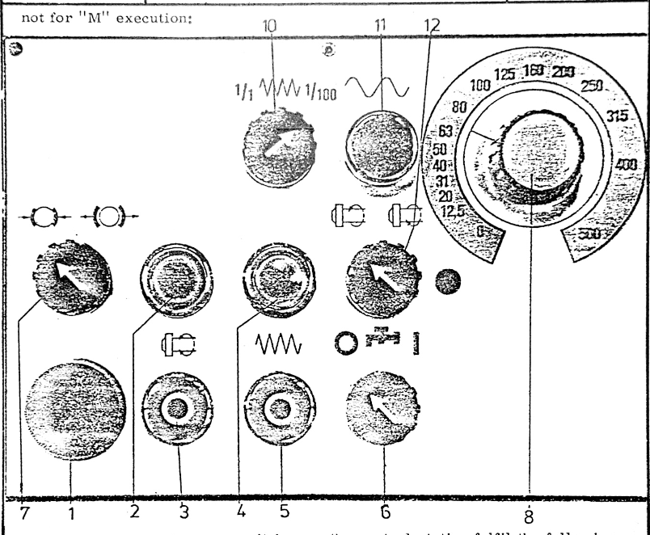
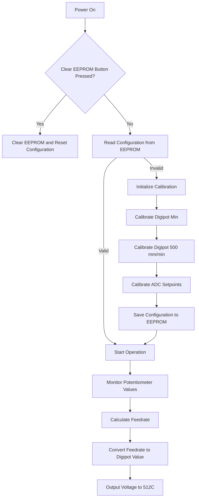
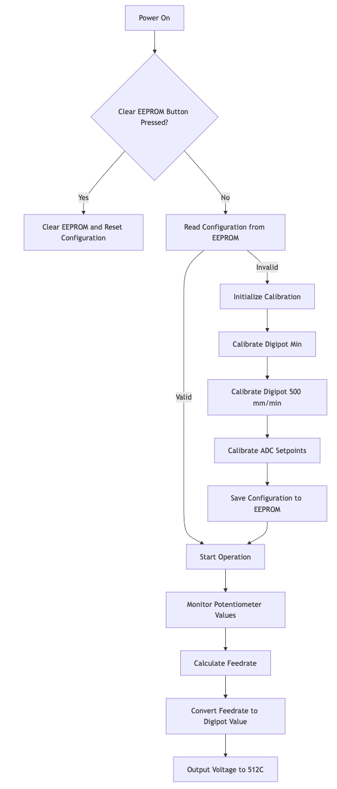
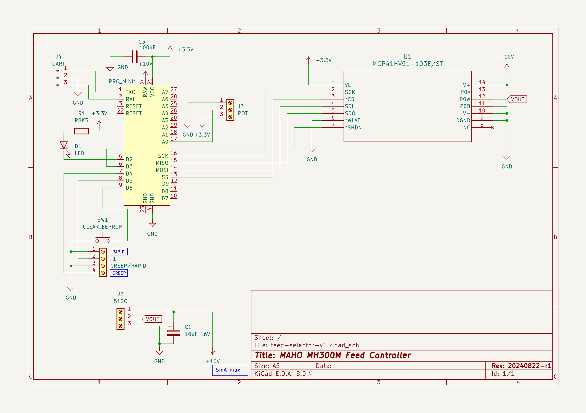
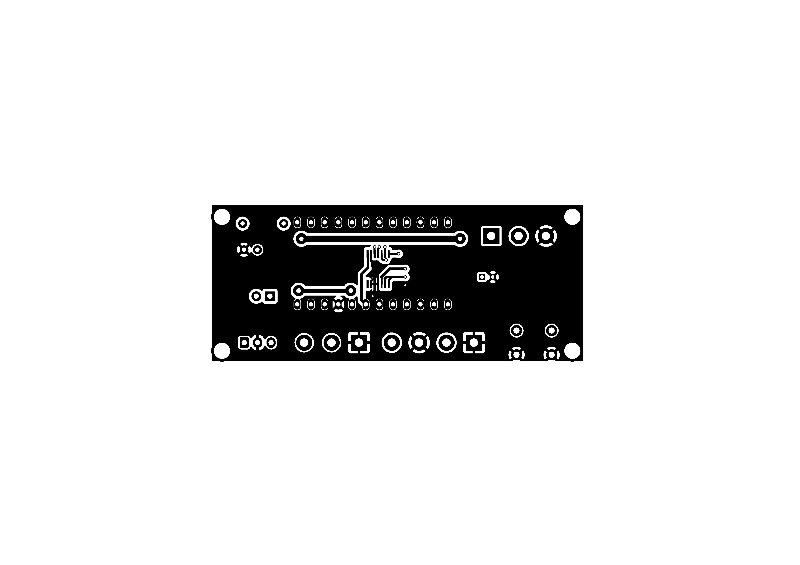
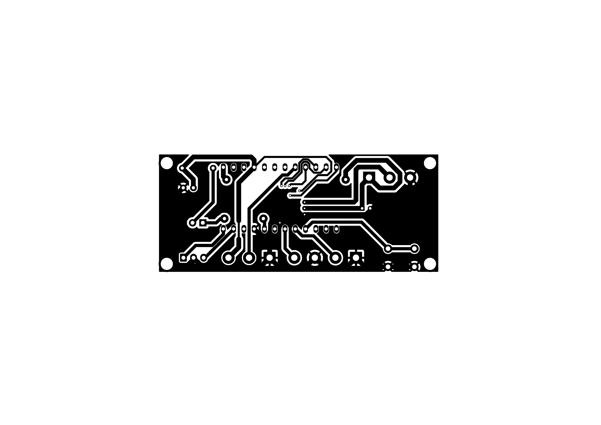
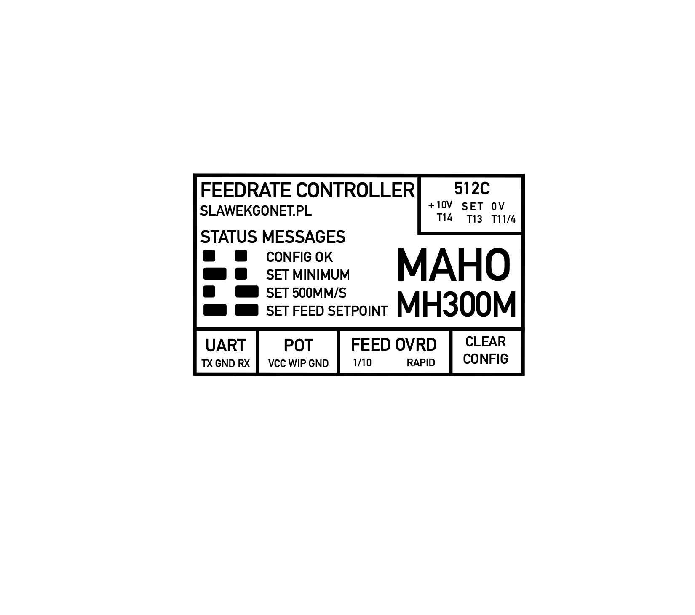

# MAHO MH300M Feedrate Controller

## 1. Introduction

### 1.1 Purpose

The MH300M Feedrate Controller is designed to precisely align the panel readings for feed control on the MAHO MH300M milling machine with the voltage output for the tachogenerator. This ensures that the machine operates with accurate and reliable feed rates after the original BBbC LE 10 b-E driver was replaced with a Parker 512C driver.

### 1.2 Overview

This device is retrofitted into the control box of the MAHO MH300M, requiring no changes to the existing wiring. It connects to the Parker 512C driver, the machine's potentiometer, and the control panel's RAPID and CREEP (1/100) buttons. The device converts arbitrary potentiometer values into a calibrated voltage output, ensuring that the machine's feed rates are consistent and accurate.

### 1.3 MAHO MH300M Control Panel



10. Creep feed rate switch (1/1 - 1/100). *Note: MAHO MH300M Feedrate Controller reduces the feed rate by a factor of 10 instead of 100 when in Creep Mode.*
11. Rapid feed rate switch.
12. Feedrate potentiometer.

## 2. Device Components and Connections

### 2.1 Connectors

The device has the following connectors:

- **512C Connector**: 
  - +10V Reference (maximum 5mA)
  - Analog Setpoint (output from the device)
  - Ground (GND)
- **Potentiometer Connector**: Connects to the machine's potentiometer.
- **RAPID and CREEP Button Connectors**: Connects to the control panel's RAPID and CREEP (1/100) buttons.
- **Clear EEPROM Button**: Used to reset the device's configuration stored in EEPROM.

### 2.2 LED Indicator

The device includes an LED indicator used to convey various status messages during setup and operation. The LED blinks in specific patterns to communicate different messages.

## 3. Configuration and Calibration

### 3.1 Initial Setup

Upon installation, the device requires calibration to match the feed rates of the milling machine with the appropriate voltage output. This calibration process is stored in the device's EEPROM, ensuring that the settings persist even after power cycles.

### 3.2 Clearing EEPROM

If you need to reset the device to its default configuration, press and hold the **Clear EEPROM** button while powering on the device. This will erase all stored settings and reset the device to its factory state.

**Note:** Clearing the EEPROM will require recalibration.

### 3.3 Calibration Procedures

Calibration is done in two main steps: configuring the digital potentiometer and setting the ADC steps.

#### 3.3.1 Digital Potentiometer Calibration

1. **Minimum Feed Rate Calibration**: 
   - The **Minimum Feed Rate** is the lowest feed rate at which the milling machine can operate stably. This feed rate is crucial as it ensures that the machine can perform slow movements without stalling, particularly under heavy loads.
   - To accurately determine the minimum feed rate, it's recommended to run all axes simultaneously, especially the Z-axis moving upward, as this simulates the heaviest load.
   - The device will enter the calibration mode for the minimum feed rate (in mm/min).
   - The LED will blink a long-short pattern (`-.`).
   - The device reads the analog input for 30 seconds to determine the minimum digital potentiometer value necessary to maintain stable operation.

2. **500 mm/min Feed Rate Calibration**:
   - The 500 mm/min feed rate serves as a key reference point. This feed rate corresponds to a voltage output of **4.16V** at the terminals of the Parker 512C.
   - The LED will blink a short-long pattern (`.-`).
   - To accurately measure this, connect a voltmeter to the 512C terminals to account for any voltage drop between the control box and the driver.
   - The device adjusts the potentiometer until the voltmeter reads exactly 4.16V, ensuring that the machine's feed rate is precisely 500 mm/min.

#### 3.3.2 ADC Steps Calibration

The device divides the feed rate range into 16 steps, each representing a specific feed rate.

1. **Step Calibration**:
   - For each step, the device reads the analog input for 5.5 seconds.
   - The LED will blink a long-long pattern (`--`) during each step.
   - For each step, set the potentiometer `10` on control panel to the corresponding feed rate (0, 12.5, 20, 31, 40, 50, 63, 80, 100, 125, 160, 200, 250, 315, 400, 500 mm/min).
   - The device will automatically store the ADC value corresponding to each feed rate in the EEPROM.

#### 3.3.3 EEPROM Storage

Once calibration is complete, the device will store the configuration in EEPROM, indicated by two short blinks (`..`). The device will then use this configuration to convert potentiometer values into the appropriate voltage output.

### 3.4 Manual Calibration and Monitoring via UART

#### 3.4.1 Overview

The UART interface is the primary method for monitoring and configuring the MH300M Feedrate Controller. This interface allows you to observe real-time status messages during the calibration process and verify the configuration settings. You can use any UART-capable device, such as a USB-to-UART adapter or a device like the Flipper Zero, to connect to the controller and monitor the serial output.

#### 3.4.2 Setting Up UART Communication

To begin using UART communication:

1. **Connect the Device**:
   - Connect the device's UART pins to your computer using a USB-to-UART adapter or to a handheld UART interface like the Flipper Zero.
   - Ensure the connection uses the correct UART pins (TX, RX, GND).

2. **Open a Serial Terminal**:
   - Open a serial terminal program on your computer (such as PuTTY, Tera Term, or the Arduino IDE's Serial Monitor).
   - Set the baud rate to **9600**.
   - Configure the terminal for **8 data bits, no parity, and 1 stop bit** (8N1).

3. **Start the Device**:
   - Power on the device. The serial terminal will begin displaying messages as the device goes through its initialization and calibration process.

#### 3.4.3 Calibration Process and UART Messages

The calibration process involves several steps, each of which is communicated via the UART interface. Below is a detailed breakdown of the calibration process, along with the messages you will see in the UART terminal.

1. **Initialization**:
   - **Starting Message**:
     - **UART Message**: `starting`
     - Description: Indicates that the device has powered on and is beginning the setup process.
   - **Button Setup**:
     - **UART Message**: `setting up buttons`
     - Description: The device configures the input pins for the RAPID, CREEP, and CLEAR EEPROM buttons.

2. **Configuration Reading**:
   - **Valid Configuration**:
     - **UART Message**: `valid config`
     - Description: Indicates that the device successfully read a valid configuration from the EEPROM.
   - **Invalid Configuration**:
     - **UART Message**: `invalid configuration`
     - Description: The configuration in the EEPROM is either missing or corrupt, triggering the initialization of a new calibration process.

3. **Calibration Steps**:
   - **Digital Potentiometer Minimum Calibration**:
     - **UART Message**: `initializing configuration`
     - Description: The device begins the calibration process.
     - **UART Message**: `config.digipot_min: <value>`
     - Description: The device determines and displays the minimum digital potentiometer value required for stable operation.
   - **Digital Potentiometer 500 mm/min Calibration**:
     - **UART Message**: `config.digipot_500: <value>`
     - Description: The device calculates and displays the digital potentiometer value corresponding to a 500 mm/min feed rate.
   - **ADC Setpoint Calibration**:
     - **UART Message**: `config.feed_<feed_rate>: <adc_value>`
     - Description: For each step in the feed rate table, the device reads and displays the corresponding ADC value. This process repeats for each of the 16 predefined steps.
   - **Completion Message**:
     - **UART Message**: `initialization complete`
     - Description: Indicates that the calibration process has finished successfully, and the configuration has been stored in the EEPROM.

#### 3.4.4 Operation Monitoring via UART

During normal operation, the UART interface continues to output real-time status messages, allowing you to monitor the device's performance:

- **Feed Rate and Voltage Output**:
  - **UART Message**: `fr: <feedrate>mm/min / <voltage>V`
  - Description: Displays the current feed rate in mm/min and the corresponding voltage output to the Parker 512C.

#### 3.4.5 Troubleshooting via UART

Use the UART messages to diagnose issues:

- If the device repeatedly outputs `invalid configuration`, ensure that the EEPROM is not corrupted or repeatedly reset.
- Monitor the feed rate and voltage messages to verify that the device operates as expected under different conditions (e.g., with RAPID or CREEP buttons pressed).

### 3.4.6 Flowchart of the Calibration Process with UART Monitoring




## 4. Operation

### 4.1 Normal Operation

Once configured, the device operates automatically, continuously converting the potentiometer's analog signal into a precise voltage output that drives the tachogenerator. This output is based on the calibrated settings stored in EEPROM.

### 4.2 Button Functions

- **RAPID Button**: When pressed, the feed rate is set to 1200 mm/min, overriding the potentiometer setting.
- **CREEP Button**: When pressed, the feed rate is reduced by a factor of 10.

### 4.3 Power Saving Mode

The device enters a low-power state between readings to conserve energy. This does not affect the device's performance but ensures it operates efficiently.

## 5. Maintenance and Troubleshooting

### 5.1 Regular Maintenance

The device requires minimal maintenance. Periodically check the connectors and wiring to ensure they are secure and free of damage.

### 5.2 Troubleshooting

- **No Output Voltage**: Verify that the device is receiving power and that the potentiometer is functioning correctly.
- **Incorrect Feed Rate**: Re-run the calibration procedure to ensure the settings are accurate.
- **LED Indicator Not Blinking**: Check the LED connections and ensure the device is powered on.

## 6. Technical Specifications

- **Input Voltage**: 10V from the Parker 512C
- **Analog Setpoint Output Range**: 0-10V
- **Maximum Current Draw**: 5mA from the 10V reference
- **EEPROM Storage**: Non-volatile memory storing calibration settings
- **Power Saving Mode**: Automatic, with 250ms sleep cycles

## 7. Safety Information

- Ensure all connections are secure before powering on the device.
- Do not attempt to modify the device's hardware.
- Use the device only for its intended purpose with the MAHO MH300M milling machine.

## Chapter 8: Programming the MH300M Feedrate Controller

### 8.1 Overview

Programming the MH300M Feedrate Controller involves configuring the microcontroller, setting fuse bits, and uploading the firmware. This chapter provides general guidelines on how to perform these tasks using standard AVR/Arduino practices.

### 8.2 Fuse Settings

Fuse settings are crucial for defining how the microcontroller operates at a hardware level. The fuses should be set to ensure the following:

- **Clock Source**: The microcontroller should use the internal oscillator with a specific clock divider to achieve the desired operating frequency (e.g., 1 MHz).
- **Bootloader Settings**: The fuses should be configured to allow the microcontroller to use a bootloader, if applicable.
- **EEPROM Retention**: Ensure that the EEPROM data is preserved during a chip erase.
- **Brown-Out Detection**: Configure the Brown-Out Detection (BOD) settings according to the requirements, or disable it if not needed.

These settings are typically configured using low, high, and extended fuse bits. Proper fuse settings ensure that the device runs at the correct speed, retains necessary data, and operates reliably under different power conditions.

### 8.3 Build Configuration

When building the firmware for the MH300M Feedrate Controller, the following flags and settings should be considered:

- **Microcontroller Type**: Ensure that the target microcontroller (e.g., ATmega328P) is correctly specified in the build configuration.
- **CPU Frequency**: Set the CPU frequency to match the hardware configuration (e.g., 1 MHz).
- **Build Flags**: Include any necessary build flags to define specific operational parameters or to include/exclude certain features.
  - For example, you might use a flag to specify that the firmware is built for a specific Arduino variant or to control how certain libraries behave.
- **Libraries**: Ensure all required libraries are included, such as those for low-power management or for controlling peripheral devices like digital potentiometers.

### 8.4 Firmware Upload

The firmware can be uploaded to the microcontroller using either an ISP programmer or via a bootloader using a USB-to-UART converter.

- **ISP Upload**: Use an In-System Programmer (ISP) to directly flash the firmware onto the microcontroller. This method allows for full control, including setting fuse bits.
- **UART Upload**: If using a bootloader, upload the firmware via a USB-to-UART converter. Ensure that the correct upload protocol (e.g., stk500v1) and baud rate (e.g., 9600) are set.

During the upload process, you may need to specify additional flags for the upload tool to correctly communicate with the microcontroller and write the firmware.

### 8.5 Final Steps

After programming:

1. **Verify Fuse Settings**: Ensure that the fuse settings are correctly applied.
2. **Test the Device**: Power on the device and verify basic functionality, such as LED indicators and response to input signals.
3. **Monitor Output**: If applicable, use a UART interface to monitor the device’s startup messages and operational status.

By following these general guidelines, you can ensure that the MH300M Feedrate Controller is programmed correctly and operates as intended.

# Appendix A: Schematics

The following schematics detail the connections and components used in the MH300M Feedrate Controller:



# Appendinx B: Bill of Materials

|Id |Designator|Footprint                                       |Quantity|Designation      |
|---|----------|------------------------------------------------|--------|-----------------|
|1  |C1        |CP_Radial_D4.0mm_P2.00mm                        |1       |10uF 16V         |                |      |      |
|2  |J4        |JST_XH_B3B-XH-A_1x03_P2.50mm_Vertical           |1       |UART             |                |      |      |
|3  |R1        |R_Axial_DIN0207_L6.3mm_D2.5mm_P7.62mm_Horizontal|1       |R8K3             |                |      |      |
|4  |U1        |TSSOP14_MC_MCH                                  |1       |MCP41HV51-103E/ST|                |      |      |
|5  |J1        |TerminalBlock_bornier-4_P5.08mm                 |1       |CREEP/RAPID      |                |      |      |
|6  |J3        |TerminalBlock_bornier-3_P5.08mm                 |1       |POT              |                |      |      |
|7  |PRO_MINI1 |Arduino_Pro_Mini (3V3, 8MHz)                    |1       |~                |                |      |      |
|8  |C3        |C_Disc_D5.0mm_W2.5mm_P2.50mm                    |1       |100nF            |                |      |      |
|9  |SW1       |SW_PUSH_6mm                                     |1       |CLEAR_EEPROM     |                |      |      |
|10 |J2        |TerminalBlock_bornier-3_P5.08mm                 |1       |512C             |                |      |      |
|11 |D1        |LED_D5.0mm                                      |1       |LED              |                |      |      |

# Appendix C: PCB Layout

## Top Layer


## Bottom Layer


# Appendix D: Case sticker



# Appendix E: Firmware Source Code

## `include/blinkmsg.h`
```cpp
#ifndef BLINKMSG_H
#define BLINKMSG_H

enum BLINKMSG {
  BLINKMSG_CONFIG_OK,
  BLINKMSG_SETUP_DIGIPOT_MIN,
  BLINKMSG_SETUP_DIGIPOT_500,
  BLINKMSG_SETUP_ADC_SETPOINT,
};

void blinkmsg(int blinkmsg);
#endif
```

## `include/config.h`
```cpp
// Arduino Mega 2560
#ifdef ARDUINO_AVR_MEGA2560
#define ANALOG_PIN A0
#define RAPID_BTN_PIN 52
#define CREEP_BTN_PIN 53
#define CLEAR_EEPROM_BTN_PIN 51
#define CS_PIN 10
#define SHDN_PIN 54
#define LED_PIN 55
#endif

// Arduino Pro Mini 3.3V 8MHz
#ifdef ARDUINO_AVR_PRO
#define ANALOG_PIN A0
#define RAPID_BTN_PIN 5
#define CREEP_BTN_PIN 4
#define CLEAR_EEPROM_BTN_PIN 9
#define CS_PIN 10
// #define SHDN_PIN 6
// #define LED_PIN 5
#define SHDN_PIN 3
#define LED_PIN 2
#endif
```

## `src/main.cpp`
```cpp
#include <Arduino.h>
#include <EEPROM.h>
#include <LowPower.h>
#include <MCP41HVX1.h>
#include <SPI.h>
#include <blinkmsg.h>
#include <config.h>

MCP41HVX1 digipot(CS_PIN, SHDN_PIN, MCP41HVX1_PIN_NOT_CONFIGURED);

#define ADC_MAX 1023
#define DIGIPOT_MAX 255

#define N_STEPS 16    // Number of steps in the conversion table
#define RAPID 1200    // Rapid feed rate in mm/min
#define CREEP_DIV 10  // Creep feed rate divisor

#define CONFIG_VERSION 2
struct EepromConfig {
  int version;
  int digipot_min;  // Minimum digipot value for stable feed rate (15bit)
  int digipot_500;  // digipot value for 500mm/min feed rate - 4.16V measured at
                    // controller (15bit)
  int adc_setpoint[N_STEPS];  // ADC setpoint for each step in the conversion
                              // table
};

// ADC setpoints (feed rate) for each step in the conversion table
// note: 12mm/min is used instead of 12.5mm/min to avoid floating point
// arithmetic
int feed_table[N_STEPS] = {0,   12,  20,  31,  40,  50,  63,  80,
                           100, 125, 160, 200, 250, 315, 400, 500};

// Config - unititialized, to be read from EEPROM
EepromConfig config;

//
// Setup functions
//

// Reset configuration
void reset_eeprom_config(int addr) {
  EepromConfig default_config = {
      .version = 0, .digipot_min = 0, .digipot_500 = 0, .adc_setpoint = {0}};
  EEPROM.put(addr, default_config);
}

// Read config from EEPROM
bool read_config(EepromConfig *config) {
  int addr = 0;

  // Reset configuration if CLEAR_EEPROM button is pressed
  if (digitalRead(CLEAR_EEPROM_BTN_PIN) == LOW) {
    Serial.println("resetting configuration");
    reset_eeprom_config(addr);
    return false;
  }

  EepromConfig eeprom_config;
  EEPROM.get(addr, eeprom_config);
  if (eeprom_config.version == CONFIG_VERSION) {
    Serial.println("valid config");
    blinkmsg(BLINKMSG_CONFIG_OK);
    *config = eeprom_config;
    return true;
  } else {
    Serial.println("invalid configuration");
    return false;
  }
}

// Write empty config to EEPROM with version 0, enforcing reinitialization
void reset_eeprom_config() {
  EepromConfig default_config = {
      .version = 0, .digipot_min = 0, .digipot_500 = 0, .adc_setpoint = {0}};
  EEPROM.put(0, default_config);
}

// Setup buttons
void setup_buttons() {
  Serial.println("setting up buttons");
  pinMode(RAPID_BTN_PIN, INPUT_PULLUP);
  pinMode(CREEP_BTN_PIN, INPUT_PULLUP);
  pinMode(CLEAR_EEPROM_BTN_PIN, INPUT_PULLUP);
  pinMode(LED_PIN, OUTPUT);
  digitalWrite(LED_PIN, HIGH);
}

//
// Calibration procedures
//

// Calibrate digital potentionmeter
int calibrate_digipot(const char *name, unsigned int wait_time) {
  Serial.print("config.");
  Serial.print(name);
  Serial.print(": ");
  Serial.flush();

  // Keep reading the analog input for wait_time ms
  unsigned long start = millis();
  int digipot_out = 0;
  while (millis() - start < wait_time) {
    int adc_in = analogRead(ANALOG_PIN);
    digipot_out = map(adc_in, 0, ADC_MAX, 0, DIGIPOT_MAX);
    digipot.WiperSetPosition(digipot_out);
    delay(100);
  }

  Serial.println(digipot_out);

  return digipot_out;
}

// Calibrate ADC steps
//
void calibrate_adc_step(unsigned int step, int *buf, unsigned int wait_time) {
  int feed = feed_table[step];

  Serial.print("config.feed_");
  Serial.print(feed);
  Serial.print(": ");

  // Keep reading the analog input for wait_time ms
  unsigned long start = millis();
  int adc_in = 0;
  while (millis() - start < wait_time) {
    adc_in = analogRead(ANALOG_PIN);
    delay(100);
  }

  buf[step] = adc_in;

  Serial.println(adc_in);
}

void initialize_config() {
  Serial.println("initializing configuration");
  blinkmsg(BLINKMSG_SETUP_DIGIPOT_MIN);
  int digipot_min = calibrate_digipot("digipot_min", 30000);
  blinkmsg(BLINKMSG_SETUP_DIGIPOT_500);
  int digipot_500 = calibrate_digipot("digipot_500", 30000);

  EepromConfig new_config = {.version = CONFIG_VERSION,
                             .digipot_min = digipot_min,
                             .digipot_500 = digipot_500,
                             .adc_setpoint = {0}};

  for (int i = 0; i < N_STEPS; i++) {
    blinkmsg(BLINKMSG_SETUP_ADC_SETPOINT);
    calibrate_adc_step(i, new_config.adc_setpoint, 5500);
  }

  blinkmsg(BLINKMSG_CONFIG_OK);
  EEPROM.put(0, new_config);
}

// Value mapping
//

// For given ADC input range, return the id of the lower bound
// of the range that contains the value
int find_range(int adc_value) {
  // Example:
  // adc_setpoint = {0, 100, 200, 300}
  // adc_value = 150
  // [1]:100 < adc_value:150 <= [2]:200
  // return 1

  for (int i = 0; i < N_STEPS - 1; i++) {
    if (config.adc_setpoint[i] < adc_value &&
        adc_value <= config.adc_setpoint[i + 1]) {
      return i;
    }
  }
  return 0;
}

// For given ADC value, return the feedrate in mm/min
// based on the conversion table and the current setpoint
// and the state of the rapid and creep buttons
int feedrate() {
  int adc_value = analogRead(ANALOG_PIN);
  int range_id = find_range(adc_value);

  bool rapid = digitalRead(RAPID_BTN_PIN) == LOW;
  bool creep = digitalRead(CREEP_BTN_PIN) == LOW;

  int feedrate = 0;

  if (rapid) {
    feedrate = RAPID;
  } else if (adc_value < config.adc_setpoint[1]) {
    /* Round adc values for feeds lower than 12mm/min (between 0 and first step)
     * to 0 to avoid feedrate oscillation */
    feedrate = 0;
  } else if (adc_value == 0) {
    feedrate = 0;
  } else {
    feedrate = map(adc_value, config.adc_setpoint[range_id],
                   config.adc_setpoint[range_id + 1], feed_table[range_id],
                   feed_table[range_id + 1]);
  }

  if (creep && !rapid) {
    feedrate = feedrate / CREEP_DIV;
  }
  return feedrate;
}

// Convert feedrate in mm/min to digipot value
// based on the current configuration
// If reported feedrate is non-zero, but the calculated digipot value is below
// the minimum, return the minimum digipot value to ensure stable operation
long int feedrate_to_digipot(int feedrate) {
  long feed_digipot = (long)feedrate * (long)config.digipot_500 / 500;

  if (feedrate == 0) {
    return 0;
  } else if (feed_digipot > DIGIPOT_MAX) {
    return DIGIPOT_MAX;
  } else if (feed_digipot > 0 && feed_digipot < config.digipot_min) {
    return config.digipot_min;
  } else {
    return feed_digipot;
  }
}

bool setup_complete = false;

void setup() {
  Serial.begin(9600);
  Serial.println("starting");
  Serial.flush();
  setup_buttons();

  if (!read_config(&config)) {
    initialize_config();
    read_config(&config);
  }

  Serial.flush();
}

void loop() {
  int feedrate_val = feedrate();
  long int digipot_value = feedrate_to_digipot(feedrate_val);
  long int mv = map(digipot_value, 0, DIGIPOT_MAX, 0, 10000);

  if (digipot_value > 0) {
    digipot.ResistorNetworkEnable();
    digipot.WiperSetPosition(digipot_value);
  } else {
    digipot.ResistorNetworkDisable();
  }

  int v = mv / 1000;
  int v_mod = mv % 1000;
  char buf[64];
  sprintf(buf, "fr: %4dmm/min / %1d.%02dV", feedrate_val, v, v_mod / 10);
  Serial.println(buf);
  Serial.flush();

  LowPower.powerDown(SLEEP_250MS, ADC_OFF, BOD_OFF);
}
```

## `src/blinkmsg.cpp`
```cpp
#include <Arduino.h>
#include <blinkmsg.h>
#include <config.h>

#define MESSAGE_LENGTH 1000
#define MESSAGE_SHORT 100
#define MESSAGE_LONG 700

//
// LED messages
//

void blink_led(const char *msg) {
  for (int i = 0; i < 2; i++) {
    if (msg[i] == '.') {
      digitalWrite(LED_PIN, LOW);
      delay(MESSAGE_SHORT);
      digitalWrite(LED_PIN, HIGH);
      delay(MESSAGE_LENGTH - MESSAGE_SHORT);
    } else if (msg[i] == '-') {
      digitalWrite(LED_PIN, LOW);
      delay(MESSAGE_LONG);
      digitalWrite(LED_PIN, HIGH);
      delay(MESSAGE_LENGTH - MESSAGE_LONG);
    }
  }
}

void blinkmsg(int blinkmsg) {
  switch (blinkmsg) {
    case BLINKMSG_CONFIG_OK:
      blink_led("..");
      break;
    case BLINKMSG_SETUP_DIGIPOT_MIN:
      blink_led("-.");
      break;
    case BLINKMSG_SETUP_DIGIPOT_500:
      blink_led(".-");
      break;
    case BLINKMSG_SETUP_ADC_SETPOINT:
      blink_led("--");
      break;
  }
}
```

